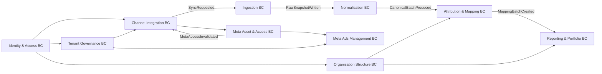

# Backend Standards

## Table of Contents

- [Overview](#overview)
- [Technology Stack](#technology-stack)
  - [Core Technologies](#core-technologies)
  - [Database & ORM](#database--orm)
  - [Testing Framework](#testing-framework)
  - [Development Tools](#development-tools)
- [Architecture Overview](#architecture-overview)
  - [Domain-Driven Design (DDD)](#domain-driven-design-ddd)
  - [Layered Architecture](#layered-architecture)
  - [Project Structure](#project-structure)
- [Domain-Driven Design Principles](#domain-driven-design-principles)
  - [Entities](#entities)
  - [Value Objects](#value-objects)
  - [Aggregates](#aggregates)
  - [Repositories](#repositories)
  - [Domain Services](#domain-services)
  - [Additional Recommendations](#additional-recommendations)
- [SOLID and DRY Principles](#solid-and-dry-principles)
  - [Single Responsibility Principle (SRP)](#single-responsibility-principle-srp)
  - [Open/Closed Principle (OCP)](#openclosed-principle-ocp)
  - [Liskov Substitution Principle (LSP)](#liskov-substitution-principle-lsp)
  - [Interface Segregation Principle (ISP)](#interface-segregation-principle-isp)
  - [Dependency Inversion Principle (DIP)](#dependency-inversion-principle-dip)
  - [DRY (Don't Repeat Yourself)](#dry-dont-repeat-yourself)
- [Coding Standards](#coding-standards)
  - [Language and Naming Conventions](#language-and-naming-conventions)
  - [Java 25 Usage](#java-25-usage)
  - [Error Handling](#error-handling)
  - [Validation Patterns](#validation-patterns)
  - [Logging Standards](#logging-standards)
- [API Design Standards](#api-design-standards)
  - [REST Endpoints](#rest-endpoints)
  - [Request/Response Patterns](#requestresponse-patterns)
  - [Error Response Format](#error-response-format)
  - [CORS Configuration](#cors-configuration)
- [Database Patterns](#database-patterns)
  - [JPA Entity Design](#jpa-entity-design)
  - [Migrations](#migrations)
  - [Repository Pattern](#repository-pattern)
- [Testing Standards](#testing-standards)
  - [Unit Testing](#unit-testing)
  - [Integration Testing](#integration-testing)
  - [Test Coverage Requirements](#test-coverage-requirements)
  - [Mocking Standards](#mocking-standards)
- [Performance Best Practices](#performance-best-practices)
  - [Database Query Optimization](#database-query-optimization)
  - [Concurrency Patterns](#concurrency-patterns)
  - [Error Handling Performance](#error-handling-performance)
- [Security Best Practices](#security-best-practices)
  - [Input Validation](#input-validation)
  - [Environment Variables](#environment-variables)
  - [Dependency Injection](#dependency-injection)
- [Development Workflow](#development-workflow)
  - [Git Workflow](#git-workflow)
  - [Development Scripts](#development-scripts)
  - [Code Quality](#code-quality)
- [Container Deployment](#container-deployment)
  - [Docker Configuration](#docker-configuration)
  - [AWS ECS / Fargate](#aws-ecs--fargate)

## Overview

This document outlines the best practices, conventions, and standards used in the backend application. The backend is built with **Java 25 on the JVM** using **Spring Boot 4** and **Spring MVC**, follows Domain-Driven Design (DDD) principles, and implements a layered architecture to ensure code consistency, maintainability, and scalability.

> **Spring Boot 4 note**: The team is targeting Spring Boot 4 milestone releases for early adoption. Watch for API changes around `@MockBean` (replaced by `@MockitoBean` in Spring Boot 4 test slices) and any Jakarta EE namespace updates. Consult the Spring Boot 4 migration guide before upgrading.

## Technology Stack

### Core Technologies
- **JVM 25**: Runtime environment (`eclipse-temurin:25` base image)
- **Java 25**: Modern, statically-typed JVM language (LTS release, September 2025)
- **Spring Boot 4**: Application framework (milestone; team is targeting early adoption)
- **Spring MVC**: Blocking web layer (`@RestController`)

### Database & ORM
- **PostgreSQL**: Relational database (Docker container)
- **Spring Data JPA + Hibernate**: ORM for database access (`@Entity`, `JpaRepository`)
- **Flyway**: Database migration tool (version-controlled SQL migrations)

### Testing Framework
- **JUnit 5**: Testing framework (`@Test`, `@ExtendWith`)
- **Mockito**: Mocking library (`@Mock`, `@InjectMocks`, `when().thenReturn()`, `verify()`)
- **AssertJ**: Fluent assertion library (`assertThat(result).isEqualTo(...)`)
- **Testcontainers**: Real database in integration tests
- **Coverage Threshold**: 90% for branches, functions, lines, and statements (enforced via JaCoCo)
- **Test Location**: `src/test/java/` mirroring the main source tree

### Development Tools
- **SonarLint**: IDE-first static analysis and code quality (IntelliJ / VS Code plugin)
- **SonarQube / SonarCloud**: CI-level quality gate (configured via `sonar-project.properties`)
- **Gradle**: Build tool (multi-project Kotlin DSL build scripts — the build language is Kotlin DSL; the application source language is Java)
- **Docker / docker compose**: Local development environment

## Architecture Overview

### Domain-Driven Design (DDD)

Domain-Driven Design is a methodology that focuses on modeling software according to business logic and domain knowledge. By centering development on a deep understanding of the domain, DDD facilitates the creation of complex systems.

**Benefits:**
- **Improved Communication**: Promotes a common language between developers and domain experts, improving communication and reducing interpretation errors.
- **Clear Domain Models**: Helps build models that accurately reflect business rules and processes.
- **High Maintainability**: By dividing the system into subdomains, it facilitates maintenance and software evolution.

### Layered Architecture

The backend follows a layered DDD architecture spread across Gradle sub-projects:

The same four layers exist within every bounded context, scoped under `modules/[bc]/`:

**Interfaces Layer** (`modules/[bc]/interfaces/http/`)
- `@RestController` classes handle HTTP requests/responses
- Controllers delegate to application-layer handlers or use-cases
- BC-owned DTOs live in `interfaces/http/dto/`
- No business logic; only HTTP translation (parsing, serialisation, status codes)

**Application Layer** (`modules/[bc]/application/`)
- CQRS-style: `commands/`, `queries/`, `handlers/`, `usecases/`
- Handlers orchestrate domain calls and publish domain events
- Input DTOs validated here via Bean Validation (`@Valid`)

**Domain Layer** (`modules/[bc]/domain/`)
- Pure Java: `record` value objects, `final` class aggregates/entities, `sealed class` errors
- Repository port interfaces (no Spring/JPA annotations)
- Domain events, invariants, policies, and services
- No external dependencies — the heart of each bounded context

**Infrastructure Layer** (`modules/[bc]/infrastructure/`)
- `persistence/entity/` — Spring Data JPA `@Entity` classes
- `persistence/repository/` — `JpaRepository` implementations
- `persistence/mapper/` — translates between JPA entities and domain models
- `external/acl/` — Anti-Corruption Layer adapters for external APIs (where applicable)

**Cross-cutting concerns** (`bootstrap/` + `shared-kernel/`)
- `bootstrap/` — composition root: DI wiring (`di/`), web config, error handling advice, in-process event bus
- `shared-kernel/` — smallest possible shared primitives: typed IDs, result types, `ProblemDetails`, `EventEnvelope`
- Flyway migrations in `apps/api/src/main/resources/db/migration/`

### Project Structure

```
apps/api/
  src/
    main/
      java/com/yourco/click/
        ApiApplication.java                         ← Spring Boot entry

        bootstrap/                                  ← composition root + glue
          di/
            ModuleRegistry.java                     ← wires module ports to controllers
          messaging/
            InProcessEventBus.java                  ← in-memory pub/sub (replaceable)
          web/
            WebConfig.java                          ← Jackson/CORS/etc
            ErrorHandlingAdvice.java                ← @ControllerAdvice
            RequestContextFilter.java               ← builds ActorContext (userId, tenantId, roles)
          persistence/
            DbConfig.java                           ← JPA/Flyway config

        shared-kernel/                              ← smallest possible shared primitives
          api/
            EventEnvelope.java                      ← integration event wrapper
            ProblemDetails.java
          domain/
            ids/                                    ← TenantId, UserId, OrgNodeId
            result/
            time/
            errors/

        modules/                                    ← ALL bounded contexts live here
          identity-access/                          ← BC 1
            api/                                    ← ONLY thing other modules may import
              contracts/
              ports/
              events/
            domain/
              aggregates/
              entities/
              valueobjects/
              services/
              policies/
              events/                               ← domain events (internal)
              invariants/
            application/
              commands/
              queries/
              handlers/
              usecases/
            infrastructure/
              persistence/
                entity/
                repository/
                mapper/
              security/
            interfaces/
              http/                                 ← controllers specific to this BC
                routes/                             ← optional: route grouping
                controller/
                dto/                                ← HTTP request/response DTOs (BC-owned)
              messaging/                             ← event handlers/subscriptions

          tenant-governance/                        ← BC 2 (same internal shape)
            api/
            domain/
            application/
            infrastructure/
            interfaces/

          organisation-structure/                   ← BC 3 (PropertyGroup + Hotel)
            api/
            domain/
            application/
            infrastructure/
            interfaces/

          channel-integration/                      ← BC 4 (generic integration lifecycle)
            api/
            domain/
            application/
            infrastructure/
            interfaces/

          meta-asset-access/                        ← BC 5 (Meta connection/assets/bindings)
            api/
            domain/
            application/
            infrastructure/
              external/
                acl/                                ← MetaMarketingAPIAdapter
              persistence/
            interfaces/

          meta-ads-management/                      ← BC 6 (optional writes)
            api/
            domain/
            application/
            infrastructure/
              external/
                acl/                                ← mutate adapter
              persistence/
            interfaces/

          ingestion/                                ← BC 7
            api/
            domain/
            application/
            infrastructure/
              external/
                acl/                                ← ProviderFetcher(s)
              persistence/
                rawstore/
            interfaces/

          normalisation/                            ← BC 8
            api/
            domain/
            application/
            infrastructure/
              persistence/
                canonicalstore/
            interfaces/

          attribution-mapping/                      ← BC 9
            api/
            domain/
            application/
            infrastructure/
            interfaces/

          reporting-portfolio/                      ← BC 10
            api/
            domain/
            application/
            infrastructure/
              persistence/
                readmodels/
            interfaces/

      resources/
        application.yml
    test/
      java/com/yourco/click/
        architecture/
          BoundaryRulesTest.java                    ← prevents cross-module imports (seatbelt)
        modules/...                                 ← BC testsker-compose.yml
```

### Basic Context Map



## Domain-Driven Design Principles

### Entities

Entities are objects with a distinct identity that persists over time.

**Before:**
```java
// Previously, candidate data handled as an untyped map without identity
Map<String, Object> candidate = Map.of(
    "firstName", "John",
    "lastName", "Doe",
    "email", "john.doe@example.com"
);
```

**After:**
```java
// modules/[bc]/domain/aggregates/Candidate.java
public final class Candidate {

    private final UUID id;
    private final String firstName;
    private final String lastName;
    private final String email;
    private final List<Education> educations;

    public Candidate(UUID id, String firstName, String lastName, String email, List<Education> educations) {
        this.id = Objects.requireNonNull(id, "id must not be null");
        this.firstName = Objects.requireNonNull(firstName, "firstName must not be null");
        this.lastName = Objects.requireNonNull(lastName, "lastName must not be null");
        this.email = Objects.requireNonNull(email, "email must not be null");
        this.educations = List.copyOf(educations);
    }

    public Candidate(UUID id, String firstName, String lastName, String email) {
        this(id, firstName, lastName, email, List.of());
    }

    public UUID getId() { return id; }
    public String getFirstName() { return firstName; }
    public String getLastName() { return lastName; }
    public String getEmail() { return email; }
    public List<Education> getEducations() { return educations; }

    // equals, hashCode, toString omitted for brevity — generate via IDE
}
```

**Explanation**: `Candidate` is an entity because it has a unique identifier (`UUID id`) that distinguishes it from other candidates, even when other properties are identical. The `final` class and immutable fields prevent accidental mutation. `Objects.requireNonNull()` enforces non-null contracts at construction time.

**Best Practice**: Domain entities in `modules/[bc]/domain/` must be plain Java with no JPA or Spring annotations. They represent the business concept, not the database row.

### Value Objects

Value Objects describe aspects of the domain without conceptual identity. They are defined entirely by their attributes.

**Before:**
```java
// Education handled as an untyped map
Map<String, Object> education = Map.of(
    "institution", "University",
    "degree", "Bachelor",
    "startDate", "2010-01-01"
);
```

**After:**
```java
// modules/[bc]/domain/valueobjects/Education.java
public record Education(
    String institution,
    String title,
    LocalDate startDate,
    LocalDate endDate   // null when still ongoing
) {}
```

**Explanation**: `Education` is a Value Object — it describes a candidate's educational background without needing its own unique identity. Java `record` provides identity-by-value (`equals`/`hashCode` based on all components), immutability, and a compact canonical constructor. Using `LocalDate` (not `String`) makes the type self-documenting and enforces correct date handling.

**Recommendation**: Value objects that need to be persisted in the JPA layer use `@Embeddable` on a separate JPA class in `modules/[bc]/infrastructure/persistence/entity/`. The domain model itself remains annotation-free.

### Aggregates

Aggregates are clusters of objects treated as a unit, with a root entity that enforces invariants.

**Before:**
```java
// Candidate and educations handled as separate, unrelated structures
Map<String, Object> candidate = Map.of("id", 1, "name", "John Doe");
List<Map<String, Object>> educations = List.of(Map.of("candidateId", 1, "institution", "University"));
```

**After:**
```java
// modules/[bc]/domain/aggregates/Candidate.java
public final class Candidate {

    private final UUID id;
    private final String firstName;
    private final String lastName;
    private final String email;
    private final List<Education> educations;
    private final List<WorkExperience> workExperiences;

    // ... constructor and accessors ...

    public Candidate withEducation(Education education) {
        var updated = new ArrayList<>(this.educations);
        updated.add(education);
        return new Candidate(id, firstName, lastName, email, List.copyOf(updated), workExperiences);
    }
}
```

**Explanation**: `Candidate` acts as the aggregate root. `Education` and `WorkExperience` only exist in relation to a `Candidate`. All mutations flow through the aggregate root to maintain invariants. The `withEducation` method returns a new `Candidate` instance, preserving immutability.

**Recommendation**: Aggregates should be designed so all operations within the boundary maintain consistency. Use domain methods on the aggregate root (e.g., `withEducation`) rather than mutating child collections directly.

### Repositories

Repositories provide interfaces for accessing aggregates, encapsulating data access logic.

**Before:**
```java
// Direct database access without abstraction
public Candidate getCandidateById(UUID id) {
    return jdbcTemplate.queryForObject("SELECT * FROM candidates WHERE id = ?", id);
}
```

**After:**
```java
// modules/[bc]/domain/CandidateRepository.java
public interface CandidateRepository {
    Optional<Candidate> findById(UUID id);
    Candidate save(Candidate candidate);
    List<Candidate> findAll();
    void deleteById(UUID id);
}

// modules/[bc]/infrastructure/persistence/repository/CandidateRepositoryImpl.java
@Repository
public class CandidateRepositoryImpl implements CandidateRepository {

    private final CandidateJpaRepository jpaRepository;
    private final CandidateMapper mapper;

    public CandidateRepositoryImpl(CandidateJpaRepository jpaRepository, CandidateMapper mapper) {
        this.jpaRepository = jpaRepository;
        this.mapper = mapper;
    }

    @Override
    public Optional<Candidate> findById(UUID id) {
        return jpaRepository.findById(id).map(mapper::toDomain);
    }

    @Override
    public Candidate save(Candidate candidate) {
        return mapper.toDomain(jpaRepository.save(mapper.toEntity(candidate)));
    }
}
```

**Explanation**: The repository interface lives in `modules/[bc]/domain/` (no persistence dependencies). The Spring Data JPA implementation lives in `modules/[bc]/infrastructure/persistence/repository/`. The domain never knows about JPA.

**Recommendation**:
- Keep repository interfaces focused on aggregate-level operations
- Implement all data access through the repository; never call `JpaRepository` directly from services
- Use constructor injection for all dependencies (never `@Autowired` field injection)

### Domain Services

Domain Services contain business logic that does not naturally belong to a single entity or value object.

**Before:**
```java
// Loose static method with no domain context
public static int calculateAge(LocalDate birthDate) {
    return Period.between(birthDate, LocalDate.now()).getYears();
}
```

**After:**
```java
// modules/[bc]/domain/services/CandidateDomainService.java
public class CandidateDomainService {

    public int calculateAge(Candidate candidate) {
        return Period.between(candidate.getBirthDate(), LocalDate.now()).getYears();
    }

    public boolean isEligibleForRole(Candidate candidate, int minimumAge) {
        return calculateAge(candidate) >= minimumAge;
    }
}

// modules/[bc]/application/usecases/CandidateService.java
@Service
public class CandidateService {

    private final CandidateRepository candidateRepository;
    private final CandidateDomainService candidateDomainService;

    public CandidateService(CandidateRepository candidateRepository,
                            CandidateDomainService candidateDomainService) {
        this.candidateRepository = candidateRepository;
        this.candidateDomainService = candidateDomainService;
    }

    public Candidate findById(UUID id) {
        return candidateRepository.findById(id)
            .orElseThrow(() -> new DomainError.NotFound("Candidate", id));
    }
}
```

**Explanation**: `CandidateDomainService` in `modules/[bc]/domain/services/` is a plain Java class containing stateless business logic. Spring's `@Service` annotation is placed on the application-layer class that orchestrates use cases, not on pure domain classes.

### Additional Recommendations

**Use of Static Factory Methods**

Factories encapsulate complex object creation, ensuring all created objects comply with domain rules from the moment of creation.

**Recommendation**: Use static factory methods on domain classes for named constructors that validate invariants:

```java
public final class Candidate {

    // ... fields and constructor ...

    public static Candidate create(String firstName, String lastName, String email) {
        if (!email.contains("@")) {
            throw new DomainError.ValidationError("Invalid email address: " + email);
        }
        if (firstName.isBlank()) {
            throw new DomainError.ValidationError("First name must not be blank");
        }
        return new Candidate(
            UUID.randomUUID(),
            firstName.trim(),
            lastName.trim(),
            email.toLowerCase()
        );
    }
}
```

**Domain Events Integration**

Domain events handle side effects of domain operations in a decoupled manner.

**Recommendation**: Implement domain events using Spring's `ApplicationEventPublisher`. Publish events from application services after successful repository saves. Handlers are `@EventListener` annotated methods in separate components.

## SOLID and DRY Principles

### SOLID Principles

SOLID principles are five object-oriented design principles that help create more understandable, flexible, and maintainable systems.

#### Single Responsibility Principle (SRP)

Each class should have a single responsibility or reason to change.

**Before:**
```java
// A method that handles multiple responsibilities: validation and data storage
public void processCandidate(Map<String, Object> candidate) {
    String email = (String) candidate.get("email");
    if (!email.contains("@")) {
        System.out.println("Invalid email");
        return;
    }
    database.save(candidate);
    System.out.println("Candidate saved");
}
```

**After:**
```java
// @Service handles orchestration only
@Service
public class CandidateService {

    private final CandidateRepository candidateRepository;

    public CandidateService(CandidateRepository candidateRepository) {
        this.candidateRepository = candidateRepository;
    }

    public Candidate create(CreateCandidateRequest request) {
        var candidate = Candidate.create(request.firstName(), request.lastName(), request.email());
        return candidateRepository.save(candidate);
    }
}

// @RestController handles only HTTP translation
@RestController
@RequestMapping("/api/v1/candidates")
public class CandidateController {

    private final CandidateService candidateService;

    public CandidateController(CandidateService candidateService) {
        this.candidateService = candidateService;
    }

    @PostMapping
    public ResponseEntity<CandidateResponse> create(@Valid @RequestBody CreateCandidateRequest request) {
        var candidate = candidateService.create(request);
        return ResponseEntity.status(HttpStatus.CREATED).body(CandidateResponse.from(candidate));
    }
}
```

**Explanation**: The controller handles only HTTP concerns. The service handles orchestration. The domain `Candidate` handles invariants. Each class has exactly one reason to change.

#### Open/Closed Principle (OCP)

Software entities should be open for extension but closed for modification.

**Before:**
```java
// Adding functionality requires modifying the existing class
public class CandidateService {
    public void process(Candidate candidate) {
        save(candidate);
        // New requirement: also send email — must modify this class
        sendEmail(candidate);
    }
}
```

**After:**
```java
// Define an extension point via interface
public interface CandidatePostProcessor {
    void process(Candidate candidate);
}

@Component
public class EmailNotificationProcessor implements CandidatePostProcessor {

    private final EmailService emailService;

    public EmailNotificationProcessor(EmailService emailService) {
        this.emailService = emailService;
    }

    @Override
    public void process(Candidate candidate) {
        emailService.sendWelcome(candidate);
    }
}

@Service
public class CandidateService {

    private final CandidateRepository candidateRepository;
    private final List<CandidatePostProcessor> postProcessors;

    public CandidateService(CandidateRepository candidateRepository,
                            List<CandidatePostProcessor> postProcessors) {
        this.candidateRepository = candidateRepository;
        this.postProcessors = postProcessors;
    }

    public Candidate create(Candidate candidate) {
        var saved = candidateRepository.save(candidate);
        postProcessors.forEach(p -> p.process(saved));
        return saved;
    }
}
```

**Explanation**: New post-processing behaviour (emails, events, auditing) is added by implementing `CandidatePostProcessor` and registering it as a Spring bean — without touching `CandidateService`.

#### Liskov Substitution Principle (LSP)

Objects of a derived class should be replaceable with objects of the base class without altering the program's functionality.

**Recommendation**: Prefer composition over inheritance. When inheritance is used, ensure subtypes honour the contracts of their supertypes. Use `sealed` classes instead of open inheritance hierarchies where the set of subtypes is finite and known:

```java
public sealed class ApplicationStatus
        permits ApplicationStatus.Pending, ApplicationStatus.Reviewing,
                ApplicationStatus.Rejected, ApplicationStatus.Accepted {

    public static final class Pending extends ApplicationStatus {}
    public static final class Reviewing extends ApplicationStatus {}
    public static final class Rejected extends ApplicationStatus {
        private final String reason;
        public Rejected(String reason) { this.reason = reason; }
        public String getReason() { return reason; }
    }
    public static final class Accepted extends ApplicationStatus {}

    private ApplicationStatus() {}
}
```

Each `ApplicationStatus` subtype is a valid substitution for `ApplicationStatus` in all contexts.

#### Interface Segregation Principle (ISP)

Many specific interfaces are better than a single general interface.

**Before:**
```java
// A large interface that most clients don't fully use
public interface CandidateOperations {
    Candidate save(Candidate candidate);
    boolean validate(Candidate candidate);
    void sendEmail(Candidate candidate);
    byte[] generateReport(Candidate candidate);
}
```

**After:**
```java
// modules/[bc]/domain/CandidateRepository.java
public interface CandidateRepository {
    Optional<Candidate> findById(UUID id);
    Candidate save(Candidate candidate);
    List<Candidate> findAll();
}

// Separate interface for reporting concerns
public interface CandidateReportPort {
    byte[] generateReport(UUID candidateId);
}
```

**Explanation**: Interfaces are focused on a single cohesive responsibility. Services only depend on the interfaces they actually use.

#### Dependency Inversion Principle (DIP)

High-level modules should not depend on low-level modules; both should depend on abstractions.

**Before:**
```java
// Direct dependency on a concrete JPA repository
public class CandidateService {
    private final CandidateJpaRepository jpaRepository = new CandidateJpaRepository();

    public Optional<Candidate> findById(UUID id) {
        return jpaRepository.findById(id);
    }
}
```

**After:**
```java
// @Service depends on the domain interface, not the JPA implementation
@Service
public class CandidateService {

    private final CandidateRepository candidateRepository;  // domain interface

    public CandidateService(CandidateRepository candidateRepository) {
        this.candidateRepository = candidateRepository;
    }

    public Candidate findById(UUID id) {
        return candidateRepository.findById(id)
            .orElseThrow(() -> new DomainError.NotFound("Candidate", id));
    }
}
```

**Explanation**: `CandidateService` depends on the `CandidateRepository` domain interface. Spring injects `CandidateRepositoryImpl` (the JPA implementation) at runtime. This allows swapping implementations without touching the service.

### DRY (Don't Repeat Yourself)

Each piece of knowledge should have a single, unambiguous, and authoritative representation.

**Before:**
```java
// Email validation duplicated across multiple methods
public void saveCandidate(Candidate candidate) {
    if (!candidate.getEmail().contains("@")) throw new IllegalArgumentException("Invalid email");
    // save logic
}

public void updateCandidate(Candidate candidate) {
    if (!candidate.getEmail().contains("@")) throw new IllegalArgumentException("Invalid email");
    // update logic
}
```

**After:**
```java
// Validation centralised on the domain model via static factory
public final class Candidate {

    public static Candidate create(String email, /* ... */) {
        if (!email.contains("@")) {
            throw new DomainError.ValidationError("Invalid email address: " + email);
        }
        return new Candidate(UUID.randomUUID(), email, /* ... */);
    }
}

// Both save and update use the same validated Candidate type
```

**Explanation**: Email validation is centralised in `Candidate.create()`. Any code that holds a `Candidate` instance can trust it has a valid email.

## Coding Standards

### Language and Naming Conventions

- **Methods, local variables**: `camelCase` (e.g., `candidateId`, `findCandidateById`)
- **Classes, interfaces, records, enums**: `PascalCase` (e.g., `Candidate`, `CandidateRepository`)
- **Static final constants**: `UPPER_SNAKE_CASE` (e.g., `MAX_CANDIDATES_PER_PAGE`)
- **Files**: `PascalCase`, one top-level public type per file, filename matches type name (e.g., `CandidateController.java`)
- **Suffix conventions**: `Controller`, `Service`, `Repository`, `UseCase`, `Mapper`, `Entity`
- **No `I` prefix for interfaces**: Use descriptive names like `CandidateRepository` (not `ICandidateRepository`)

**Examples:**

```java
// Good: PascalCase class, camelCase method and parameter
public class CandidateRepository {
    public Optional<Candidate> findById(UUID candidateId) {
        // implementation
    }
}

// Avoid: Non-English names or I-prefix interfaces
public class RepositorioCandidato {
    public Optional<Candidate> buscarPorId(UUID idCandidato) { /* ... */ }
}
public interface ICandidateRepository { /* ... */ }  // avoid the I prefix
```

**Error Messages and Logs:**

```java
// Good: English messages with context
throw new DomainError.NotFound("Candidate", id);
log.error("Failed to create candidate: {}", e.getMessage());

// Avoid: Non-English messages
throw new IllegalStateException("Candidato no encontrado con el ID proporcionado");
```

### Java 25 Usage

Java 25 introduces several language features that are prescribed as standard practice:

#### Records — for immutable DTOs and value objects

```java
// Value object
public record Education(String institution, String title, LocalDate startDate, LocalDate endDate) {}

// DTO
public record CreateCandidateRequest(
    @NotBlank @Size(max = 100) String firstName,
    @NotBlank @Size(max = 100) String lastName,
    @NotBlank @Email String email
) {}
```

Use `record` whenever a type is:
- Immutable (all fields final by definition)
- Defined by its data (no identity beyond its components)
- A DTO, value object, or simple data carrier

#### Sealed Classes — for domain error hierarchies

```java
// shared-kernel/domain/errors/DomainError.java
public sealed class DomainError extends RuntimeException
        permits DomainError.NotFound, DomainError.ValidationError, DomainError.Conflict {

    public static final class NotFound extends DomainError {
        public NotFound(String resource, Object id) {
            super(resource + " not found with id: " + id);
        }
    }

    public static final class ValidationError extends DomainError {
        public ValidationError(String message) { super(message); }
    }

    public static final class Conflict extends DomainError {
        public Conflict(String message) { super(message); }
    }

    private DomainError(String message) { super(message); }
}
```

Use `sealed class` / `sealed interface` with `permits` for:
- Exhaustive type hierarchies where the set of subtypes is finite and known
- Domain error hierarchies
- State machines and discriminated unions

#### Pattern Matching — switch expressions and instanceof patterns

```java
// Pattern matching switch in @ControllerAdvice
@ExceptionHandler(DomainError.class)
public ResponseEntity<ErrorResponse> handleDomainError(DomainError error) {
    return switch (error) {
        case DomainError.NotFound e ->
            ResponseEntity.status(404).body(new ErrorResponse("NOT_FOUND", e.getMessage()));
        case DomainError.ValidationError e ->
            ResponseEntity.status(400).body(new ErrorResponse("VALIDATION_ERROR", e.getMessage()));
        case DomainError.Conflict e ->
            ResponseEntity.status(409).body(new ErrorResponse("CONFLICT", e.getMessage()));
    };
}

// instanceof pattern matching — no explicit cast needed
public String describe(Object obj) {
    if (obj instanceof Candidate c) {
        return "Candidate: " + c.getFirstName();
    }
    return "Unknown";
}
```

#### Nullability — Optional and requireNonNull

- **`Optional<T>`** at boundaries where absence is meaningful (repository `findById`, query results)
- **`Objects.requireNonNull()`** for constructor and method precondition checks
- Avoid returning `null` from public methods — use `Optional.empty()` instead
- Avoid `Optional` as a field type or method parameter

```java
// Good: Optional at boundary, requireNonNull internally
public Optional<Candidate> findById(UUID id) {
    return jpaRepository.findById(Objects.requireNonNull(id, "id must not be null"))
        .map(mapper::toDomain);
}

// Avoid: returning null from a public method
public Candidate findById(UUID id) {
    return jpaRepository.findById(id).orElse(null);  // forces null checks on callers
}
```

#### Constructor Injection Only

- No `@Autowired` field injection; all dependencies via constructor
- Single-constructor classes do not require `@Autowired` in Spring 6+

```java
// Good: constructor injection — testable without Spring
@Service
public class CandidateService {

    private final CandidateRepository candidateRepository;
    private final ApplicationEventPublisher eventPublisher;

    public CandidateService(CandidateRepository candidateRepository,
                            ApplicationEventPublisher eventPublisher) {
        this.candidateRepository = candidateRepository;
        this.eventPublisher = eventPublisher;
    }
}

// Avoid: field injection — not testable without Spring context
@Service
public class CandidateService {
    @Autowired
    private CandidateRepository candidateRepository;  // avoid
}
```

### Error Handling

- **Sealed class hierarchy**: Define domain errors in `shared-kernel/domain/errors/DomainError.java`
- **`@ControllerAdvice`**: Global exception handler maps domain errors to HTTP responses
- **No try/catch in controllers**: Controllers stay clean; the advice handles all exceptions
- **Pattern matching switch**: Use in `@ExceptionHandler` for exhaustive, compiler-checked error mapping

```java
// bootstrap/web/ErrorHandlingAdvice.java
@ControllerAdvice
public class ErrorHandlingAdvice {

    @ExceptionHandler(DomainError.class)
    public ResponseEntity<ErrorResponse> handleDomainError(DomainError error) {
        return switch (error) {
            case DomainError.NotFound e ->
                ResponseEntity.status(HttpStatus.NOT_FOUND)
                    .body(new ErrorResponse("NOT_FOUND", e.getMessage()));
            case DomainError.ValidationError e ->
                ResponseEntity.status(HttpStatus.BAD_REQUEST)
                    .body(new ErrorResponse("VALIDATION_ERROR", e.getMessage()));
            case DomainError.Conflict e ->
                ResponseEntity.status(HttpStatus.CONFLICT)
                    .body(new ErrorResponse("CONFLICT", e.getMessage()));
        };
    }

    @ExceptionHandler(MethodArgumentNotValidException.class)
    public ResponseEntity<ErrorResponse> handleBeanValidation(MethodArgumentNotValidException e) {
        var details = e.getBindingResult().getFieldErrors().stream()
            .map(fe -> fe.getField() + ": " + fe.getDefaultMessage())
            .toList();
        return ResponseEntity.status(HttpStatus.BAD_REQUEST)
            .body(new ErrorResponse("VALIDATION_ERROR", "Validation failed", details));
    }
}

public record ErrorResponse(String code, String message, List<String> details) {
    public ErrorResponse(String code, String message) {
        this(code, message, List.of());
    }
}
```

### Validation Patterns

- **Bean Validation**: Use `jakarta.validation` annotations on record components and DTO fields
- **`@Valid`**: Annotate controller method parameters to trigger validation
- **Custom validators**: Implement `ConstraintValidator` for domain-specific rules

```java
// modules/[bc]/interfaces/http/dto/CreateCandidateRequest.java
public record CreateCandidateRequest(
    @NotBlank(message = "First name must not be blank")
    @Size(max = 100)
    String firstName,

    @NotBlank(message = "Last name must not be blank")
    @Size(max = 100)
    String lastName,

    @NotBlank
    @Email(message = "Must be a valid email address")
    String email
) {}

// Controller — trigger validation with @Valid
@PostMapping
public ResponseEntity<CandidateResponse> create(@Valid @RequestBody CreateCandidateRequest request) {
    var candidate = candidateService.create(request);
    return ResponseEntity.status(HttpStatus.CREATED).body(CandidateResponse.from(candidate));
}
```

### Logging Standards

- **SLF4J + Logback**: Spring Boot's default logging stack
- **Logger declaration**: Declare per class using `LoggerFactory.getLogger(getClass())`

```java
import org.slf4j.Logger;
import org.slf4j.LoggerFactory;

@Service
public class CandidateService {

    private static final Logger log = LoggerFactory.getLogger(CandidateService.class);

    private final CandidateRepository candidateRepository;

    public CandidateService(CandidateRepository candidateRepository) {
        this.candidateRepository = candidateRepository;
    }

    public Candidate create(CreateCandidateRequest request) {
        log.info("Creating candidate with email: {}", request.email());
        var candidate = Candidate.create(request.firstName(), request.lastName(), request.email());
        var saved = candidateRepository.save(candidate);
        log.info("Candidate created with id: {}", saved.getId());
        return saved;
    }
}
```

- **Log levels**: Use `info` for significant events, `warn` for recoverable issues, `error` for failures, `debug` for diagnostic detail
- **Structured logging**: Include meaningful context (IDs, operation names) in log messages
- **Never log secrets**: Do not log passwords, tokens, or PII

## API Design Standards

### REST Endpoints

- **RESTful Naming**: Use RESTful conventions for endpoint naming
- **HTTP Methods**: Use appropriate HTTP methods (GET, POST, PUT, DELETE, PATCH)
- **Resource-Based URLs**: URLs represent resources, not actions
- **Versioning**: Prefix all endpoints with `/api/v1/`

```
GET    /api/v1/candidates          # List candidates
GET    /api/v1/candidates/{id}     # Get candidate by ID
POST   /api/v1/candidates          # Create new candidate
PUT    /api/v1/candidates/{id}     # Replace candidate
PATCH  /api/v1/candidates/{id}     # Partial update
DELETE /api/v1/candidates/{id}     # Delete candidate
```

### Request/Response Patterns

- **JSON Format**: Use JSON for request and response bodies
- **Consistent Structure**: Maintain consistent response structure across all endpoints
- **Status Codes**: Use appropriate HTTP status codes

```json
// Success response
{
    "success": true,
    "data": { "id": "...", "firstName": "John", "lastName": "Doe" },
    "message": "Operation completed successfully"
}

// Error response
{
    "success": false,
    "error": {
        "code": "NOT_FOUND",
        "message": "Candidate not found with id: ..."
    }
}
```

```java
// Response wrapper
public record ApiResponse<T>(boolean success, T data, String message) {
    public static <T> ApiResponse<T> ok(T data) {
        return new ApiResponse<>(true, data, null);
    }
}

// Usage in controller
@GetMapping("/{id}")
public ResponseEntity<ApiResponse<CandidateResponse>> getById(@PathVariable UUID id) {
    var candidate = candidateService.findById(id);
    return ResponseEntity.ok(ApiResponse.ok(CandidateResponse.from(candidate)));
}
```

### Error Response Format

- **Consistent Format**: All errors follow the same response structure
- **Error Codes**: Use meaningful codes for different error types
- **HTTP Status Codes**: Map errors to appropriate HTTP status codes

```json
// 400 Bad Request
{
    "success": false,
    "error": {
        "code": "VALIDATION_ERROR",
        "message": "Validation failed",
        "details": ["email: Must be a valid email address"]
    }
}

// 404 Not Found
{
    "success": false,
    "error": {
        "code": "NOT_FOUND",
        "message": "Candidate not found with id: 123e4567-e89b-12d3-a456-426614174000"
    }
}
```

### CORS Configuration

- **Enable CORS**: Configure CORS to allow frontend origin
- **Secure Configuration**: Only allow specific origins in production
- **Credentials**: Configure credentials handling appropriately

```java
// bootstrap/web/WebConfig.java
@Configuration
public class WebConfig implements WebMvcConfigurer {

    @Value("${app.cors.allowed-origins}")
    private String allowedOrigins;

    @Override
    public void addCorsMappings(CorsRegistry registry) {
        registry.addMapping("/api/**")
            .allowedOrigins(allowedOrigins.split(","))
            .allowedMethods("GET", "POST", "PUT", "PATCH", "DELETE", "OPTIONS")
            .allowCredentials(true);
    }
}
```

```yaml
# application.yml
app:
  cors:
    allowed-origins: ${FRONTEND_URL:http://localhost:3000}
```

## Database Patterns

### JPA Entity Design

- **Separate from domain model**: JPA `@Entity` classes live in `modules/[bc]/infrastructure/persistence/entity/`, not in `modules/[bc]/domain/`
- **Naming**: Suffix JPA classes with `Entity` (e.g., `CandidateEntity`)
- **UUID primary keys**: Use `UUID` as the primary key type
- **Mappers**: Always translate between entity and domain via a dedicated `Mapper` class

```java
// modules/[bc]/infrastructure/persistence/entity/CandidateEntity.java
@Entity
@Table(name = "candidates")
public class CandidateEntity {

    @Id
    private UUID id;

    @Column(nullable = false)
    private String firstName;

    @Column(nullable = false)
    private String lastName;

    @Column(nullable = false, unique = true)
    private String email;

    @OneToMany(mappedBy = "candidate", cascade = CascadeType.ALL, orphanRemoval = true)
    private List<EducationEntity> educations = new ArrayList<>();

    // No-arg constructor required by JPA
    protected CandidateEntity() {}

    public CandidateEntity(UUID id, String firstName, String lastName, String email) {
        this.id = id;
        this.firstName = firstName;
        this.lastName = lastName;
        this.email = email;
    }

    // Getters omitted for brevity
}

// modules/[bc]/infrastructure/persistence/repository/CandidateJpaRepository.java
public interface CandidateJpaRepository extends JpaRepository<CandidateEntity, UUID> {
    Optional<CandidateEntity> findByEmail(String email);
}

// modules/[bc]/infrastructure/persistence/mapper/CandidateMapper.java
@Component
public class CandidateMapper {

    public Candidate toDomain(CandidateEntity entity) {
        return new Candidate(
            entity.getId(),
            entity.getFirstName(),
            entity.getLastName(),
            entity.getEmail()
        );
    }

    public CandidateEntity toEntity(Candidate domain) {
        return new CandidateEntity(
            domain.getId(),
            domain.getFirstName(),
            domain.getLastName(),
            domain.getEmail()
        );
    }
}
```

### Migrations

- **Version Control**: All database changes are version-controlled via Flyway SQL migrations
- **Naming**: Use `V{version}__{description}.sql` convention (e.g., `V1__create_candidates.sql`)
- **Immutable**: Never modify an existing applied migration; always add a new one
- **Location**: `apps/api/src/main/resources/db/migration/`

```sql
-- V1__create_candidates.sql
CREATE TABLE candidates (
    id          UUID         NOT NULL PRIMARY KEY,
    first_name  VARCHAR(100) NOT NULL,
    last_name   VARCHAR(100) NOT NULL,
    email       VARCHAR(255) NOT NULL UNIQUE,
    created_at  TIMESTAMPTZ  NOT NULL DEFAULT NOW(),
    updated_at  TIMESTAMPTZ  NOT NULL DEFAULT NOW()
);
```

### Repository Pattern

- **Domain interface in `modules/[bc]/domain/`**: No persistence framework annotations
- **JPA implementation in `modules/[bc]/infrastructure/persistence/repository/`**: Implements the domain interface
- **Mapper translates**: Between JPA entity and domain model

```java
// modules/[bc]/domain/CandidateRepository.java
public interface CandidateRepository {
    Optional<Candidate> findById(UUID id);
    Optional<Candidate> findByEmail(String email);
    Candidate save(Candidate candidate);
    List<Candidate> findAll();
    void deleteById(UUID id);
}

// modules/[bc]/infrastructure/persistence/repository/CandidateRepositoryImpl.java
@Repository
public class CandidateRepositoryImpl implements CandidateRepository {

    private final CandidateJpaRepository jpaRepository;
    private final CandidateMapper mapper;

    public CandidateRepositoryImpl(CandidateJpaRepository jpaRepository, CandidateMapper mapper) {
        this.jpaRepository = jpaRepository;
        this.mapper = mapper;
    }

    @Override
    public Optional<Candidate> findById(UUID id) {
        return jpaRepository.findById(id).map(mapper::toDomain);
    }

    @Override
    public Optional<Candidate> findByEmail(String email) {
        return jpaRepository.findByEmail(email).map(mapper::toDomain);
    }

    @Override
    public Candidate save(Candidate candidate) {
        return mapper.toDomain(jpaRepository.save(mapper.toEntity(candidate)));
    }

    @Override
    public List<Candidate> findAll() {
        return jpaRepository.findAll().stream().map(mapper::toDomain).toList();
    }

    @Override
    public void deleteById(UUID id) {
        jpaRepository.deleteById(id);
    }
}
```

## Testing Standards

The project has strict requirements for code quality and maintainability. These are the testing standards and best practices that must be applied.

### Test File Structure
- Use descriptive test file names: `[ComponentName]Test.java`
- Place test files in `src/test/java/` mirroring the package structure of the production code
- Use JUnit 5 with Mockito for unit tests; `@WebMvcTest` / `@DataJpaTest` / `@SpringBootTest` for slice and integration tests
- Maintain **90% coverage threshold** for branches, functions, lines, and statements (enforced by JaCoCo)

### Test Organization Pattern

Template:
```java
@ExtendWith(MockitoExtension.class)
class CandidateServiceTest {

    @Mock
    CandidateRepository candidateRepository;

    @InjectMocks
    CandidateService candidateService;

    @Test
    void shouldReturnCandidateWhenFoundById() {
        // Arrange
        var id = UUID.randomUUID();
        var expected = new Candidate(id, "John", "Doe", "john@example.com");
        when(candidateRepository.findById(id)).thenReturn(Optional.of(expected));

        // Act
        var result = candidateService.findById(id);

        // Assert
        assertThat(result).isEqualTo(expected);
        verify(candidateRepository, times(1)).findById(id);
    }

    @Test
    void shouldThrowNotFoundWhenCandidateDoesNotExist() {
        // Arrange
        var id = UUID.randomUUID();
        when(candidateRepository.findById(id)).thenReturn(Optional.empty());

        // Act / Assert
        assertThatThrownBy(() -> candidateService.findById(id))
            .isInstanceOf(DomainError.NotFound.class);
    }
}
```

### Test Case Naming Convention
- Use descriptive camelCase method names: `shouldReturnCandidateWhenFoundById`
- Group related test cases using `@Nested` inner classes
- Name `@Nested` classes as `WhenCondition` or `GivenContext`

```java
@Nested
class WhenFindingById {

    @Test
    void shouldReturnCandidateWhenItExists() { /* ... */ }

    @Test
    void shouldThrowNotFoundWhenItDoesNotExist() { /* ... */ }
}
```

### Test Structure (AAA Pattern)
Always follow the Arrange-Act-Assert pattern:

```java
@Test
void shouldUpdateCandidateStageSuccessfullyWhenValidDataProvided() {
    // Arrange — set up test data and mocks
    var candidateId = UUID.randomUUID();
    var existing = new Candidate(candidateId, "John", "Doe", "john@example.com");
    when(candidateRepository.findById(candidateId)).thenReturn(Optional.of(existing));
    when(candidateRepository.save(any())).thenAnswer(inv -> inv.getArgument(0));

    // Act — execute the function under test
    var result = candidateService.updateStage(candidateId, "INTERVIEW");

    // Assert — verify the expected behaviour
    assertThat(result.getStage()).isEqualTo("INTERVIEW");
    verify(candidateRepository, times(1)).save(any());
}
```

### Mocking Standards

- Use **Mockito** for all mocking (`@Mock`, `@InjectMocks`, `when().thenReturn()`, `verify()`)
- Mock all external dependencies (repositories, services, external clients)
- Mock the repository layer in service tests
- Mock the service layer in controller tests
- Mockito resets mocks between tests by default when using `@ExtendWith(MockitoExtension.class)`
- Use `lenient()` stubs only when the stubbing is genuinely unused in some test paths

```java
// Unit test — pure Mockito, no Spring context
@ExtendWith(MockitoExtension.class)
class CandidateServiceTest {

    @Mock CandidateRepository candidateRepository;
    @InjectMocks CandidateService candidateService;
}

// Controller slice test — Spring MVC slice with @MockitoBean (Spring Boot 4)
@WebMvcTest(CandidateController.class)
class CandidateControllerTest {

    @Autowired MockMvc mockMvc;
    @MockitoBean CandidateService candidateService;  // @MockitoBean replaces @MockBean in Spring Boot 4
}
```

### Test Coverage Requirements

- **Comprehensive test coverage**: Include these test categories for each function:
  1. **Happy Path Tests**: Valid inputs producing expected outputs
  2. **Error Handling Tests**: Invalid inputs, missing data, repository errors
  3. **Edge Cases**: Boundary values, empty collections, absent optionals
  4. **Validation Tests**: Input validation, business rule enforcement
  5. **Integration Points**: Repository calls, external service interactions

- **Threshold**: 90% for branches, functions, lines, and statements
- **Coverage Reports**: Generate with `./gradlew test jacocoTestReport`
- **Coverage Files**: Coverage reports in `build/reports/jacoco/` with a dated summary file like `YYYYMMDD-backend-coverage.md`

### Unit Testing

- No Spring context loaded — instantiate classes directly with Mockito mocks or `@ExtendWith(MockitoExtension.class)`
- Fast; suitable for the bulk of test cases
- Test business logic, error paths, and edge cases exhaustively

### Integration Testing

- **`@WebMvcTest`**: Controller slice tests — loads only the web layer; mock the service with `@MockitoBean`
- **`@DataJpaTest`**: Repository slice tests — loads only JPA; use Testcontainers for a real PostgreSQL database
- **`@SpringBootTest`**: Full application context — use sparingly for true end-to-end flow tests

```java
// Repository integration test with Testcontainers
@DataJpaTest
@AutoConfigureTestDatabase(replace = AutoConfigureTestDatabase.Replace.NONE)
@Testcontainers
class CandidateRepositoryImplTest {

    @Container
    static PostgreSQLContainer<?> postgres = new PostgreSQLContainer<>("postgres:15");

    @Autowired CandidateJpaRepository jpaRepository;
    CandidateMapper mapper = new CandidateMapper();
    CandidateRepositoryImpl repository;

    @BeforeEach
    void setUp() {
        repository = new CandidateRepositoryImpl(jpaRepository, mapper);
    }

    @Test
    void shouldPersistAndRetrieveCandidate() {
        var candidate = Candidate.create("John", "Doe", "john@example.com");
        var saved = repository.save(candidate);
        var found = repository.findById(saved.getId());

        assertThat(found).contains(saved);
    }
}
```

### Error Testing
- Test both expected domain errors and unexpected exceptions
- Verify error messages are descriptive
- Test error propagation through service layers
- Ensure correct HTTP status codes in controller tests via `mockMvc.perform(...).andExpect(status().isNotFound())`

### Controller Testing Specifics
- Use `@WebMvcTest` to load only the web layer
- Mock the service layer completely with `@MockitoBean` (Spring Boot 4)
- Test HTTP request/response handling, parameter parsing, and status codes
- Verify JSON response shape with MockMvc matchers

```java
@WebMvcTest(CandidateController.class)
class CandidateControllerTest {

    @Autowired MockMvc mockMvc;
    @MockitoBean CandidateService candidateService;

    @Test
    void shouldReturn200WithCandidateWhenFound() throws Exception {
        var id = UUID.randomUUID();
        var candidate = new Candidate(id, "John", "Doe", "john@example.com");
        when(candidateService.findById(id)).thenReturn(candidate);

        mockMvc.perform(get("/api/v1/candidates/" + id))
            .andExpect(status().isOk())
            .andExpect(jsonPath("$.data.firstName").value("John"));
    }

    @Test
    void shouldReturn404WhenCandidateNotFound() throws Exception {
        var id = UUID.randomUUID();
        when(candidateService.findById(id)).thenThrow(new DomainError.NotFound("Candidate", id));

        mockMvc.perform(get("/api/v1/candidates/" + id))
            .andExpect(status().isNotFound())
            .andExpect(jsonPath("$.error.code").value("NOT_FOUND"));
    }
}
```

### Service Testing Specifics
- Instantiate service directly with `@Mock` / `@InjectMocks` for all dependencies
- Test business logic in isolation
- Verify data transformation and validation
- Test error handling and edge cases

### Database Testing
- Use Testcontainers with a real PostgreSQL container for repository tests
- Test both successful and failed database operations
- Verify correct queries via repository method tests
- `@DataJpaTest` with `@AutoConfigureTestDatabase(replace = NONE)` for real database slices

### Test Data Management
- Use static factory methods or builder patterns for test data creation
- Keep test data consistent and realistic
- Avoid hardcoded strings in multiple places; use `static final` constants
- Use meaningful test data that reflects real-world scenarios

### Common Anti-Patterns to Avoid
- Don't test implementation details — test observable behaviour
- Don't create overly complex test setups
- Don't ignore failing tests or skip error scenarios
- Don't use real database connections in unit tests (use Mockito)
- Don't use raw `assertNull` — prefer AssertJ's `assertThat(result).isNull()` or `isEmpty()`
- Don't write tests that are tightly coupled to implementation details (e.g., private method calls)

## Performance Best Practices

### Database Query Optimization

- **Select Specific Fields**: Use projections or DTOs instead of loading full entities when only a subset is needed
- **Use Indexes**: Ensure proper database indexes for frequently queried fields (defined in Flyway migrations)
- **Avoid N+1 Queries**: Use `JOIN FETCH` in JPQL or `@EntityGraph` to fetch related data efficiently

```java
// Good: Fetch related data in a single query
public interface CandidateJpaRepository extends JpaRepository<CandidateEntity, UUID> {

    @Query("SELECT c FROM CandidateEntity c LEFT JOIN FETCH c.educations WHERE c.id = :id")
    Optional<CandidateEntity> findByIdWithEducations(@Param("id") UUID id);
}

// Avoid: N+1 — loading educations one by one in a loop
public List<Candidate> findAll() {
    return jpaRepository.findAll().stream()
        .map(entity -> {
            // This triggers a separate query per candidate for educations
            return mapper.toDomainWithEducations(entity);
        })
        .toList();
}
```

### Concurrency Patterns

Spring MVC is synchronous/blocking by design, which is appropriate for this project's stack. For operations that can be parallelised at the JVM level:

- **`@Async`**: Offload non-critical background work (e.g., email notifications) to a thread pool
- **Parallel service calls**: Use `CompletableFuture.supplyAsync` when fetching from independent sources
- **Database transactions**: Use `@Transactional` at the service method level; never at the controller level

```java
// Parallel independent calls
var candidatesFuture = CompletableFuture.supplyAsync(candidateRepository::findAll);
var positionsFuture  = CompletableFuture.supplyAsync(positionRepository::findAll);
CompletableFuture.allOf(candidatesFuture, positionsFuture).join();
var candidates = candidatesFuture.get();
var positions  = positionsFuture.get();
```

### Error Handling Performance

- **Early Returns**: Use guard clauses to return early and avoid unnecessary processing
- **Error Propagation**: Let domain errors propagate to `@ControllerAdvice`; don't catch and re-wrap unnecessarily
- **Avoid Over-Wrapping**: Catch exceptions only at boundaries where you can add meaningful context

## Security Best Practices

### Input Validation

- **Validate All Inputs**: Use Bean Validation (`@Valid`) on all controller request bodies and path/query parameters
- **Sanitize Data**: Rely on parameterised JPA queries (via Spring Data) to prevent SQL injection
- **Type Safety**: Java's type system and Bean Validation together eliminate most injection surfaces

```java
// Bean Validation on record DTO
public record CreateCandidateRequest(
    @NotBlank @Size(max = 100) String firstName,
    @NotBlank @Size(max = 100) String lastName,
    @NotBlank @Email String email
) {}

// JPA parameterised query — no SQL injection risk
public interface CandidateJpaRepository extends JpaRepository<CandidateEntity, UUID> {
    Optional<CandidateEntity> findByEmail(String email);  // Spring Data generates safe query
}
```

### Environment Variables

- **Never Commit Secrets**: Never commit `.env` files, `application-local.yml`, or any secret to version control
- **Use Environment Variables**: Configure database URLs, credentials, and API keys via environment variables
- **Validate at Startup**: Use `@ConfigurationProperties` with `@Validated` to fail fast on missing config

```java
@ConfigurationProperties(prefix = "app")
@Validated
public record AppProperties(
    @NotBlank String jwtSecret,
    @NotNull Long jwtExpirationMs,
    CorsProperties cors
) {
    public record CorsProperties(@NotBlank String allowedOrigins) {}
}
```

### Dependency Injection

- **Constructor Injection Only**: Spring instantiates all beans via constructor — no `@Autowired` on fields
- **Avoid Global State**: No static mutable state or singleton patterns that bypass Spring's IoC
- **Testability**: Constructor injection makes every class independently testable with Mockito without needing a Spring context

```java
// Good: Constructor injection — testable without Spring
@Service
public class CandidateService {

    private final CandidateRepository candidateRepository;
    private final ApplicationEventPublisher eventPublisher;

    public CandidateService(CandidateRepository candidateRepository,
                            ApplicationEventPublisher eventPublisher) {
        this.candidateRepository = candidateRepository;
        this.eventPublisher = eventPublisher;
    }
}

// Avoid: Field injection — not testable without Spring context
@Service
public class CandidateService {
    @Autowired
    private CandidateRepository candidateRepository;  // avoid
}
```

## Development Workflow

### Git Workflow

- **Feature Branches**: Develop features in separate branches with a descriptive `-backend` suffix to allow parallel work without conflicts (e.g., `feature/add-candidate-search-backend`)
- **Descriptive Commits**: Write descriptive commit messages in English
- **Code Review**: Require code review before merging
- **Small Branches**: Keep branches small and focused on a single concern

### Development Scripts

```bash
./gradlew bootRun                     # Start dev server (requires local JVM 25)
./gradlew build                       # Compile + test + package
./gradlew test                        # Run all tests
./gradlew test jacocoTestReport       # Run tests and generate coverage report
docker compose up --build             # Full stack (API + DB) via Docker
bash tools/scripts/test.sh            # Run tests via Docker (no local JVM required)
```

### Code Quality

- **SonarLint**: Install the SonarLint plugin in IntelliJ or VS Code. Run analysis on changed files before committing.
- **SonarQube / SonarCloud**: Configured via `sonar-project.properties` at the project root. CI enforces the quality gate (no new issues, coverage ≥ 90%).
- **All Tests Passing**: Ensure all tests pass and the coverage threshold is met before merging
- **Code Review**: Review code for adherence to these standards
- **No `@SuppressWarnings` without justification**: If suppressing a warning, add an inline comment explaining why

```properties
# sonar-project.properties (project root)
sonar.projectKey=my-project
sonar.sources=apps,libs
sonar.java.source=25
sonar.coverage.jacoco.xmlReportPaths=**/build/reports/jacoco/test/jacocoTestReport.xml
```

## Container Deployment

### Docker Configuration

The application is container-first. Local development and CI both use Docker.

```dockerfile
# Dockerfile (multi-stage)
FROM eclipse-temurin:25-jdk AS builder
WORKDIR /app
COPY . .
RUN ./gradlew :apps:api:bootJar --no-daemon

FROM eclipse-temurin:25-jre
WORKDIR /app
COPY --from=builder /app/apps/api/build/libs/*.jar app.jar
EXPOSE 8080
ENTRYPOINT ["java", "-jar", "app.jar"]
```

```yaml
# docker-compose.yml (local dev)
services:
  api:
    build: .
    ports:
      - "8080:8080"
    environment:
      SPRING_DATASOURCE_URL: jdbc:postgresql://db:5432/appdb
      SPRING_DATASOURCE_USERNAME: postgres
      SPRING_DATASOURCE_PASSWORD: postgres
    depends_on:
      db:
        condition: service_healthy

  db:
    image: postgres:15
    environment:
      POSTGRES_DB: appdb
      POSTGRES_USER: postgres
      POSTGRES_PASSWORD: postgres
    healthcheck:
      test: ["CMD-SHELL", "pg_isready -U postgres"]
      interval: 5s
      timeout: 5s
      retries: 5
```

### AWS ECS / Fargate

- **Container Registry**: Push images to Amazon ECR
- **Task Definition**: Define CPU, memory, and environment variables in ECS task definition
- **Load Balancer**: Expose the service via an Application Load Balancer (ALB) on port 443
- **Secrets**: Use AWS Secrets Manager or SSM Parameter Store for sensitive environment variables; reference them in the task definition rather than hardcoding
- **Health Check**: Spring Boot Actuator exposes `/actuator/health` — configure this as the ALB target group health check endpoint
- **Rolling Deployments**: Use ECS rolling update strategy (minimum 100%, maximum 200%) to achieve zero-downtime deployments

```yaml
# application.yml — Actuator health endpoint
management:
  endpoints:
    web:
      exposure:
        include: health, info
  endpoint:
    health:
      show-details: when-authorized
```

This document serves as the foundation for maintaining code quality and consistency across the backend application. All team members and AI agents should follow these practices to ensure a maintainable, scalable, and testable codebase.
